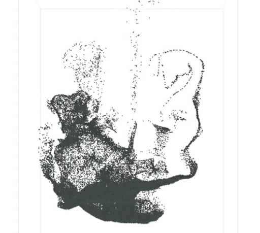
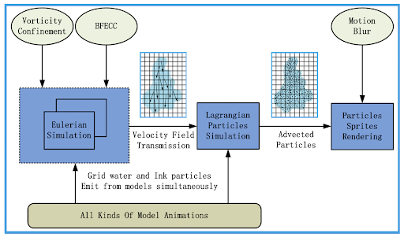
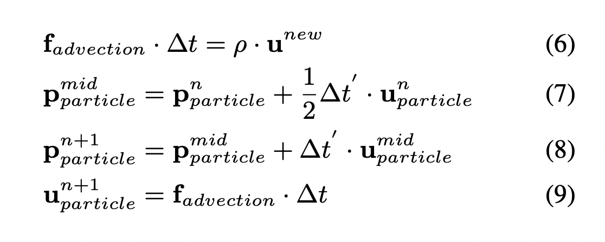
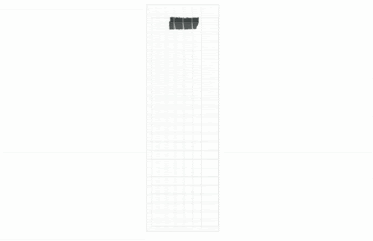
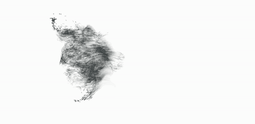
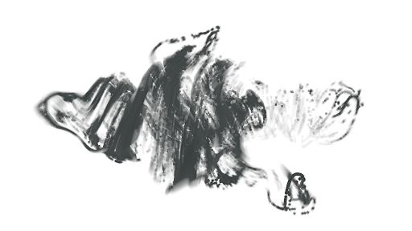
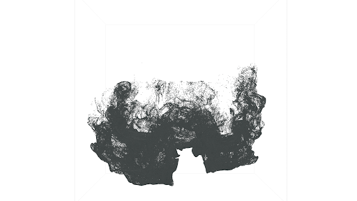

# Dynamic and Definitely Diffusive Ink Simulation

This program simulates ink diffusion in water through physical-based methods. It updates the water grid by solving incompressible Navier-Stokes equations at each timestep, and computes ink movement using the RK2 method based on the water velocity. The resulting ink particles are rendered as vertex data in Blender, featuring motion blur.

## General Approach

### Water grid
The 3D water grid is implemented with the general fluid simulation method. The velocity of each grid cell is computed based on Navier-Stokes equations, as shown below.  

### Ink flow
The position and velocity of each ink particle are updated using RK2 method, enpending entirely on water grid. 

### Rendering
The render script loops through the `.ply` files, stores the vertex data of each file, and maps the positions to keyframes to render an animation. 

## Results

**10k particles 8x25x8 grid**

**20k particles 14x30x14 grid**

**100k particles 20x45x20 grid**

**Still Frames**

## Running the code
**Requirements**\
Recommended IDE: Qt Creator\
C++ library: Eigen\
Rendering: Blender 3.3.0

To modify the number of particles and grid size, modify the global parameters in `system.h`. 

## Collaborators
Austin Miles - gizmo1479\
Helen Huang - helen-huang9\
Mande He - 12345Mandy\
Tianran Zhang - zhang-tianran

## Reference
1. Xu, S., Mei, X., Dong, W., Zhang, Z., & Zhang, X. (2011). Interactive Visual Simulation of Dynamic Ink Diffusion Effects. 
2. Cline, D., Cardon, D. L., Egbert, P. K., & Young, B. (2005). Fluid Flow for the Rest of Us: Tutorial of the Marker and Cell Method in Computer Graphics.